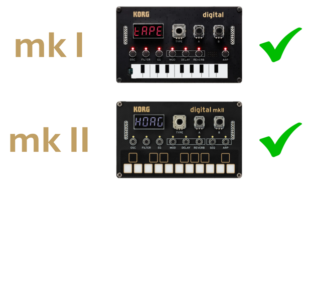
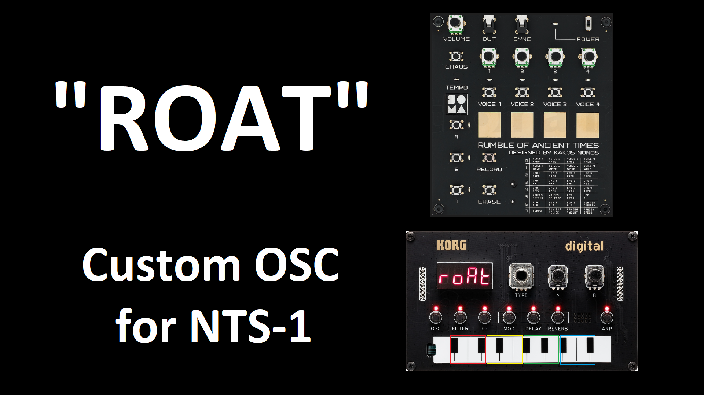

# NTS-1 Oscillators by Tweeeeeak!
Free NTS oscillators and stuff. Now for NTS-1 mk II as well.

# J6

J6 is a **chord player** oscillator and **sequencer**.

This oscillator is inspired by the Roland J-6 synthesizer, so you can check it out to understand the concept behind this oscillator.

Each note plays a different chord, and there are 100 different chord sets. These are the same as the Roland J-6 chord sets, that can be found at: https://static.roland.com/manuals/J-6_manual_v102/eng/28645807.html

It also includes:
- Mixable waveforms: saw, pulse, pulse suboscillator (with PWM for the pulse waves)
- 100 playing patterns (rhythmic, arpeggios and mixed)
- Transpose in semitones up to + or – 4 octaves
- 16-step sequencer with variable step length, for a max of 16 bars of chord playing

### Details:

- Download:
  - NTS-1 original: [j6_v201.ntkdigunit](https://github.com/tweeeeeak/nts/releases/download/j6.2.0/j6_v201.ntkdigunit)
  - NTS-1 mk II: [j6.nts1mkiiunit](https://github.com/tweeeeeak/nts/releases/download/ntsmk2.1.0.0/j6.nts1mkiiunit)
- Detailed instructions: [J6 Oscillator instructions](J6.md)
- Introduction and Demo video: https://youtu.be/3PVx-NqOhfs

# Volca Bass

The Volca Bass oscillator copies the “architecture” of the oscillator section of the **Volca Bass**.

It includes 3 oscillators, each with on/off, saw/square waveform, and pitch control up to +/-1 octave.

Includes also a **slide** function, **octave** selection (even with the ribbon), and a **step sequencer**, with 16 steps for notes or rest, and slide selection per step.

It features **3 memory slots** for sequences, and a 4th group slot, that plays all the other 3 at the same time, each to its oscillator, **paraphonically**. 

### Details:

- Download:
  - NTS-1 original: [a_free_osc_vbass.ntkdigunit](https://github.com/tweeeeeak/nts/releases/download/1.0.0/a_free_osc_vbass.ntkdigunit)
  - NTS-1 mk II: [vbass.nts1mkiiunit](https://github.com/tweeeeeak/nts/releases/download/ntsmk2.1.0.0/vbass.nts1mkiiunit)
- Detailed instructions: [Volca Bass Oscillator instructions](VolcaBass.md)
- Introduction and Demo video: https://youtu.be/wE8cbGawHDo

# ROAT

ROAT is an **8-bit** experimental oscillator inspired by the Soma "Rumble of Ancient Times" synthesizer.

It includes 4 oscillators that can be triggered independently, by pressing 4 different zones of the keyboard, or recording a step sequence.

Combining oscillator activation with the different settings per oscillator (pitch, shape, LFO) and different combination algorithms, and adding randomization and chaos, gives you a wide range of sonic possibilities, from melodic to digital noise. 

Settings per oscillator:
- Pitch
- 16 different waveshapes
- LFO (for pitch or amplitude) with 8 different shapes
- 16-step rhythmic sequence, syncable with external devices

Additional features:
- 3 oscillator combination diagrams with 6 different summing algorithms per node
- 2 randomization algorithms

### Details:

- Download:
  - NTS-1 original: [roat.ntkdigunit](https://github.com/tweeeeeak/nts/releases/download/roat.1.02.0/roat.ntkdigunit)
  - NTS-1 mk II: [roat.nts1mkiiunit](https://github.com/tweeeeeak/nts/releases/download/ntsmk2.1.0.0/roat.nts1mkiiunit)
- Detailed instructions and reference sheet: [ROAT Oscillator instructions](ROAT/ROAT.md)
- Introduction video: [https://youtu.be/3PVx-NqOhfs](https://youtu.be/KpabCfeOfdk)
- Full instructions video: https://youtu.be/4h0m3JB5GIc

# Proba-B

Proba-B is a **probability sequencer** based oscillator.

Use the built-in arpeggiator or record a step sequence, from 1 to 64 steps (default is 8 steps).
Then assign **probability** values to each step, for step **mute**, **transpose** and **shape** change.
The oscillator waveshape itself is a **triangle** waveform, with **wave folding** (shape parameter) and **frequency modulation** (alt parameter).

Works great with delay effects.

Extra features include:
- microtuning
- time division
- transpose, with auto minor to major scale converter.

### Details:

- Download:
  - NTS-1 original: [proba-b_v210.ntkdigunit](https://github.com/tweeeeeak/nts/releases/download/proba-b.2.0/proba-b_v210.ntkdigunit)
  - NTS-1 mk II: [proba-b.nts1mkiiunit](https://github.com/tweeeeeak/nts/releases/download/ntsmk2.1.0.0/proba-b.nts1mkiiunit)
- Quick reference sheet: [Proba-b.2.10.Reference.Sheet.pdf](https://github.com/tweeeeeak/nts/releases/download/proba-b.2.0/Proba-b.2.10.Reference.Sheet.pdf)
- Detailed instructions: [Proba-B Oscillator instructions](Proba-B.md)
- Introduction and Demo video: https://youtu.be/CADbPm17Uhw

