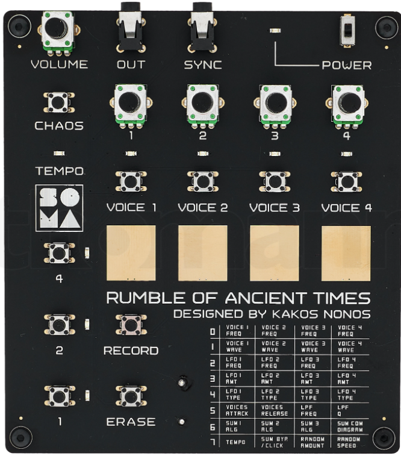
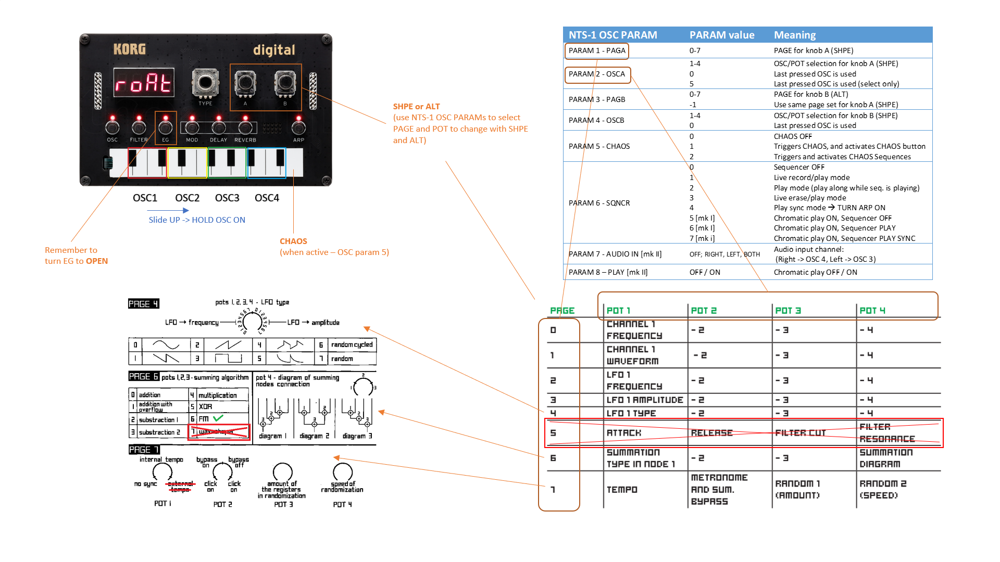
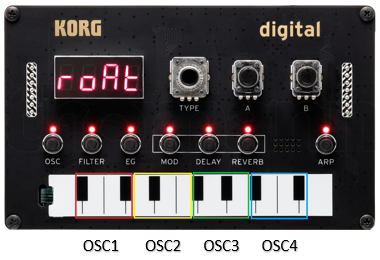
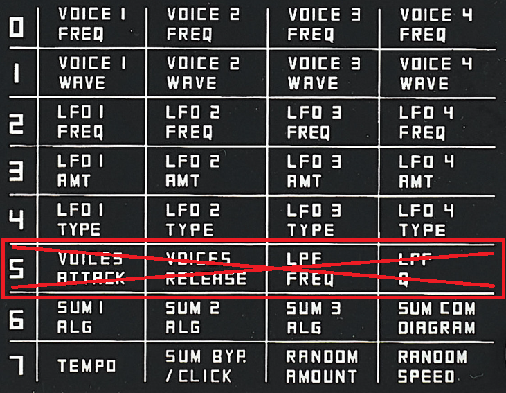
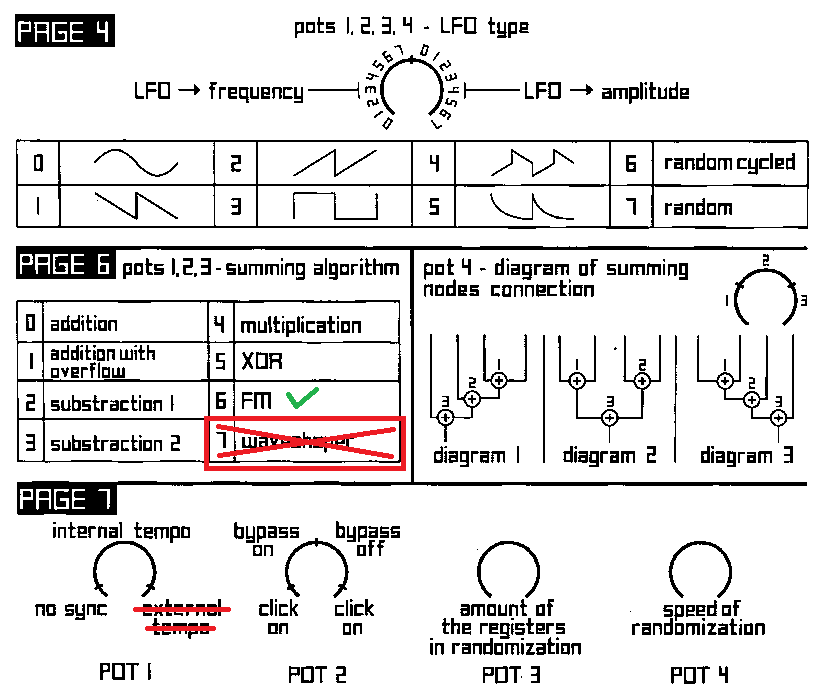

## ROAT Oscillator instructions

Introducing the “ROAT” Oscillator for Korg Nutekt NTS-1, by Tweeeeeak (https://www.youtube.com/@tweeeeeak228).

This Oscillator is free. __Download links__:
- NTS1 original: https://github.com/tweeeeeak/nts/releases/download/roat.2.01/roat201.ntkdigunit
- NTS1 mk II: https://github.com/tweeeeeak/nts/releases/download/roat.2.01/roat201.nts1mkiiunit

Youtube introduction: https://youtu.be/KpabCfeOfdk

Youtube full instructions video: https://youtu.be/4h0m3JB5GIc

ROAT is an 8-bit experimental oscillator inspired by the Soma "Rumble of Ancient Times" synthesizer (https://somasynths.com/roat/):

Many of the functions of the orignial Rumble synth are implemented in this oscillator with an interface as close as possible to the original.

Check the Rumble manual for a full description of features (https://somasynths.com/roat_specs/).

These instructions will describe how those features are implemented in the ROAT Oscillator for NTS-1.

Note: Version 2 was introduced on december 2025, check changes marked as [Version2] below.

### Quick reference sheet

Take a look at the quick reference sheet, and print it, because it will become handy:

### Oscillator activation

___Note: To fully use this oscillator you should turn the envelope to OPEN: press the EG button and turn the TYPE knob right all the way to OPEN.___

The keyboard doesn't play notes in the regular way (Unless you turn Play On, check below). Instead, it's divided into 4 sections, and each section triggers an oscillator.

So there are 4 oscillators in total. NTS-1 has 18 keys in the ribbon. Take out the first and last keys, and divide the remaining 16 keys into groups of 4. Each group corresponds to one oscillator, 1 to 4 from left to right.

If you press on one section (triggering that oscillator on), slide up and release out of that section, that oscillator will hold on. Now each time you press that section you will mute the oscillator instead. Repeat the press and slide up procedure, and that oscillator will turn off and hold off, returning to the original behaviour.

### Parameter pages

The original Rumble synth has 8 pages of parameters (0-7), and 4 parameters per page:

Pages 0-4 correspond to parameters per oscillator, so parameters 1-4 of that page correspond to oscillators 1-4.

Page 5 is not implemented, because NTS-1 already has an envelope and filter.

Pages 6 and 7 are generic parameters.

__Parameter list:__

- Page 0 [FREQ]: changes Oscillator frequency (pitch)
- Page 1 [WAVE]: changes Oscillator waveform (16 different waveforms available)
- Page 2 [LFOF]: changes LFO frequency (speed) per oscillator
- Page 3 [LFOA]: changes LFO amount per oscillator
- Page 4 [LFOT]: LFO type: changes LFO destination and shape:
  - From 0 to halfway: 8 different shapes routed to oscillator pitch
  - From halfway to full: 8 different shapes routed to oscillator volume
- Page 5 [----]: not implemented
- Page 6 [SUM]:
  - Params 1 to 3 [SUMx]: summing algorithms (algorithm 7 not implemented)
    - Algorithm 6 is FM, implemented on [Version2]. When FM is selected, the right parcel will modulate audio of the left parcel.
  - Param 4 [DIAG]: summing diagram
- Page 7 [MISC]:
  - Param 1 [TEMP]: internal tempo (for sequencer modes 1 [REC] and 2 [PLAY]). External tempo is set by the NTS-1 ARP tempo, when sequencer mode is 3 [SYNC]: synced play.
  - Param 2 [METR]: sum bypass mode and click (metronome)
  - Param 3 [RNDA]: Randomization: number of parameters to randomize
  - Param 4 [RNDS]: Randomization: speed of change

__Check the original manual for details on these parameters:__ https://somasynths.com/roat_specs/

The back of the synth includes fast reference for Pages 4, 6 and 7:

### How to change ROAT parameters on NTS-1:

Parameters are changed using knobs A and B (SHPE and ALT).

By default:
- A (SHPE) will change the waveform (PAGE 1) of the last pressed Oscillator
- B (ALT) will change the pitch (PAGE 0) of the last pressed Oscillator

To set knobs A and B to change other pages, use the NTS-1 OSC extra parameters:
- NTS OSC Param 1 (PAGA) selects the page that knob A will edit (0-7)
- NTS OSC Param 2 (OSCA) selects Oscillator/parameter of that page:
  - Values 1-4: Oscillator/parameter 1-4 will be changed by knob A
  - Value 0: The last pressed oscillator will be changed by knob A. Press an oscillator (holding or not), and turn knob A, and you will change the parameter for that oscillator, or, in pages 6-7, the corresponding parameter.
  - Value 5: Same as value 0, but pressing an oscillator won't turn it on/off. This is useful to select parameters to change using the ribbon, without affect playing oscillators.
- NTS OSC Param 3 (PAGB) selects the page that knob B will edit:
  - Values 0-7: selects page 0-7
  - Value -1: uses the same page as knob A
- NTS OSC Param 4 (OSCB) selects Oscillator/parameter of that page:
  - Values 1-4: Oscillator/parameter 1-4 will be changed by knob B
  - Value 0: The last pressed oscillator will be changed by knob B.

This way you can change all parameters of the matrix by any of the knobs, and select 2 parameters to edit in realtime, while jamming.

_Note: to change the NTS-1 OSC extra parameters: press and hold OSC and turn TYPE knob to that param, than turn B knob to change param value._

### Chaos

Activate chaos to randomize all parameters from pages 0-6 (not 7), except the ones on the pages currently selected for knobs A and B.

To activate chaos, turn NTS OSC extra param 5 (CHAOS) to 1 [SIMP].

_Note: to change the NTS-1 OSC extra parameters: press and hold OSC and turn TYPE knob to that param, than turn B knob to change param value._

To re-trigger chaos again you can:
- Turn NTS OSC extra parameter 5 (CHAOS) to 0 [OFF] and than to 1 [SIMP] again.
- OR
- Leave the CHAOS on 1 [SIMP] , and press the upper most note on the NTS-1 ribbon

[Version2] You can also turn CHAOS parameter to 2 [SEQ] to randomize and start playing a sequence. Note: this will erase the previous sequence, if existed.

### Sequencer

The NTS OSC extra Param 6 (SEQNCR) controls the sequencer.

_Note: to change the NTS-1 OSC extra parameters: press and hold OSC and turn TYPE knob to that param, than turn B knob to change param value._

The sequencer records OSC on/off in 16 steps. It doesn't record parameter changes, but you can change parameters while the sequencer is running. When you record some steps, if you invert that oscillator (remember: press and slide up will hold the oscillator on), then the sequencer will also play that OSC reversly, i.e., the OSC will be on by default, and the recorded steps will mute the OSC.

NTS OSC Param 6 (SEQNCR) values work as follows:
- Value 0 [OFF]: sequencer is __off__
- Value 1 [REQ]: sequencer is in __live recording__ mode, using internal tempo.
  - Tempo can be set using parameter 1 [TEMP] of Page 7 [MISC]
  - A 16 step sequence is running and looping continuosly
  - Pressing a section on the keyboard will record that press on the current step
  - If you press and hold during several steps, all those steps will be recorded
  - Since the sequencer is running, any recorded steps will immediatly start playing in loop.
- Value 2 [PLAY]: sequencer is in __play__ mode
  - The sequencer is playing, but if you press a section you will trigger that OSC, but without recording any steps.
- Value 3 [ERAS]: sequencer is in __erase__ mode
  - The sequencer is playing, but if you press a section it will delete those steps for that OSC
- Value 4 [SYNC]: sequencer is in __play sync__ mode
  - Turn ON the arpeggiator on latch mode and start it (press and hold ARP, then press any note on the keyboard)
  - Set the ARP range to 1 (press and hold ARP, them turn knob A to value = 1)
  - The sequencer will play with the tempo of the NTS-1 ARP
  - If NTS is tempo-synced to other devices, the sequencer will follow that tempo
  - In this mode, pressing the keyboard will have no effect
  - But you can still change any of the parameters, to change the sound

Note: while the sequencer is playing, pressing a section and sliding up will have no special effect.

### Play Chromatically [Version2]

You can play the sounds chromatically, meaning you can change the behaviour of the keyboard so that your running sound (including the running sequence) can be transposed when pressing the keys on the NTS-1 ribbon/keys, or via MIDI. To activate this do the following:

#### On NTS-1 mk I (original) 

Use NTS OSC extra Param 6 (SQNCR) as follows
- Value 5: chromatic play is __on__ and sequencer is __off__
- Value 6: chromatic play is __on__ and sequencer is __play__ mode (not synced)
- Value 7: chromatic play is __on__ and sequencer is __play sync__ mode (synced)

#### On NTS-1 mk II 

Use NTS OSC extra Param 8 (PLAY) to turn chromatic play __on__. Sequencer status is whatever is set via the SQNCR parameter, but you cannot record or erase any steps on the sequence, while chromatic play is on.

### Audio Input processing [NTS-1 mk2 only] [Version2]

You can substitute oscillator 3 and/or oscillator 4 by audio input left and right, respectivelly. To do this:

- First, make sure Audio Input is routed to OSC in NTS-1 mk2 configuration
  - Turn on the power while holding down the REVERB button.
  - Use the TYPE knob to select the global parameter to edit : [Inr] Input route
  - use the B knob to change the value to 0 (meaning Input Route to OSC)
  - press the ARP button. The settings are saved, and the NTS-1 restarts.
  - _Note: check the NTS-1 mk 2 owners manual for details on this_
- Use NTS OSC extra Param 7 (AUDIO IN) as follows:
  - Value [OFF]: Audio input is ignored
  - Value [RGHT]: Oscillator 4 is substituted by the right channel of the audio input (left channel is ignored)
  - Value [LEFT]: Oscillator 3 is substituted by the left channel of the audio input (right channel is ignored)
  - Value [BOTH]: Both oscillators 3 and 4 are substituted by the left and right channels of the audio input, respectively
 
Note that when set audio input for oscillator 3 or 4, using the keyboard or sequencer to turn oscillators on or off will result in listening or muting the input audio corresponding to that oscillator.

Audio input will be mixed with the other oscillators using the summing algorithms selected.

That includes using the audio input as a modulation source for the FM algoritm. However, you cannot modulate the audio input with FM from other oscillators.

